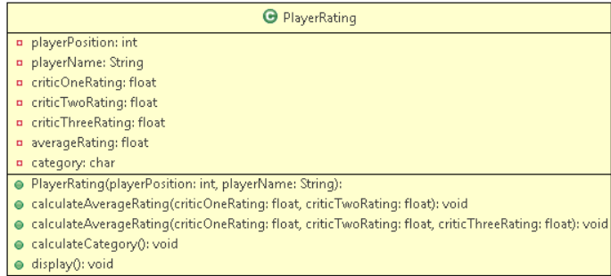
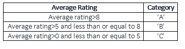

# Exercise - Develop a Java Program Using Constructor Overloading

## Problem Statement:
Objective: To understand the usage and the implementation of Method Overloading

 

Problem Description: Mysore United is a player's club which maintains the average rating of the players and sets their category based on the average rating obtained from the critics every month. The number of critics for the club varies from two to three. The PlayerRating class stores the details of the player and the class diagram is as shown below:

 

## PlayerRating:

 

The category of the player is decided based on the average calculated by the calculateAverageRating() method as follows:

 

Implement the tester class to know the rating of the player.

## Input (For two critics):

<table class="tbl-holder__tbl">
	<thead>
		<tr>
			<th>Attributes</th>
			<th>Values</th>
		</tr>
	</thead>
	<tbody>
		<tr>
			<td>Player Position</td>
			<td>1</td>
		</tr>
		<tr>
			<td>Player name</td>
			<td>Beckham</td>
		</tr>
		<tr>
			<td>CriticOneRating</td>
			<td>9</td>
		</tr>
		<tr>
			<td>CriticTwoRating</td>
			<td>9.9</td>
		</tr>
	</tbody>
</table>

### Output:

 

the player name is Beckham
the player position is 1
the average rating is 9.45
the category is A

## Input (For Three critics)

<table class="tbl-holder__tbl">
	<thead>
		<tr>
			<th>Attributes</th>
			<th>Values</th>
		</tr>
	</thead>
	<tbody>
		<tr>
			<td>Player Position</td>
			<td>1</td>
		</tr>
		<tr>
			<td>Player name</td>
			<td>Oscar</td>
		</tr>
		<tr>
			<td>CriticOneRating</td>
			<td>1</td>
		</tr>
		<tr>
			<td>CriticTwoRating</td>
			<td>1</td>
		</tr>
		<tr>
			<td>CriticThreeRating</td>
			<td>1</td>
		</tr>
	</tbody>
</table>

### Output:

 

the player name is Oscar
the player position is 1
the average rating is 1.0
the category is C
 

(Hint: Initialize the instance variable(averageRating) with the calculated average)

### Summary of this exercise:

You have learned how to achieve method overloading in Java.