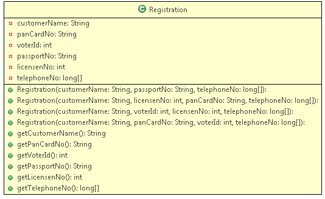

# Exercise - Develop a Java Program Using Constructor Overloading

## Problem Statement:

Objective: To understand the usage and the implementation of constructor overloading

Problem Description: Enigma has recently opened its internet services in India. The company wants users to register for their internet services. But for the authentication of the user, the company has set criteria as below:

- The customer name and two phone numbers (one alternate phone number) are compulsory fields.
- The user should have a passport. If the user is not having a passport, he/she can provide anyone of the following combinations:
- License number and pan card number.
- Voter id and license number.
- Pan card and voter id.

### The class diagram is as shown below:

## Registration:

There are different users who want to register for this service and they satisfy one of the above criteria.

Write a tester class to implement your code.

### Input:

<table class="tbl-holder__tbl">
	<thead>
		<tr>
			<th>Attributes</th>
			<th>Values</th>
		</tr>
	</thead>
	<tbody>
		<tr>
			<td>Customer Name</td>
			<td>Kevin</td>
		</tr>
		<tr>
			<td>Passport Number</td>
			<td>MN9891N</td>
		</tr>
		<tr>
			<td>Telephone Number</td>
			<td>9452425421 
			7676765252</td>
		</tr>
	</tbody>
</table>

### Output: 

Congratulations Kevin!!! you have been successfully registered for our services with the following details:
Passport number: MN989IN
Phone numbers: 9452425421
7676765252

### Input:

<table class="tbl-holder__tbl">
	<thead>
		<tr>
			<th>Attributes</th>
			<th>Values</th>
		</tr>
	</thead>
	<tbody>
		<tr>
			<td>Customer Name</td>
			<td>Julias</td>
		</tr>
		<tr>
			<td>License Number</td>
			<td>123</td>
		</tr>
		<tr>
			<td>Pan Card Number</td>
			<td>PN7878</td>
		</tr>
		<tr>
			<td>Telephone Number</td>
			<td>2345615451 
			6763562562</td>
		</tr>
	</tbody>
</table>

### Output:

Congratulations Julias!!! you have been successfully registered for our services with the following details:
License number: 123
Pan card number: PN7878
Phone numbers: 2345615451
6763562562

### Input: 

<table class="tbl-holder__tbl">
	<thead>
		<tr>
			<th>Attributes</th>
			<th>Values</th>
		</tr>
	</thead>
	<tbody>
		<tr>
			<td>Customer Name</td>
			<td>Jammy</td>
		</tr>
		<tr>
			<td>Voter id 
			License Number</td>
			<td>45453 
			765</td>
		</tr>
		<tr>
			<td>Telephone Number</td>
			<td>9634524353 
			9887373737</td>
		</tr>
	</tbody>
</table>

### Output:

Congratulations Jammy!!! you have been successfully registered for our services with the following details:
Voter id: 45453
License Number: 765
Phone numbers: 9634524353
9887373737

### Input:

<table class="tbl-holder__tbl">
	<thead>
		<tr>
			<th>Attributes</th>
			<th>Values</th>
		</tr>
	</thead>
	<tbody>
		<tr>
			<td>Customer Name</td>
			<td>Rose</td>
		</tr>
		<tr>
			<td>Pan Card Number 
			Voter id</td>
			<td>PN8934 
			34356</td>
		</tr>
		<tr>
			<td>Telephone Number</td>
			<td>9867456367 
			7645367356</td>
		</tr>
	</tbody>
</table>

### Output:

Congratulations Rose!!! you have been successfully registered for our services with the following details:
Pan card Number: PN8934
Voter id: 34356
Phone numbers: 9867456367
7645367356