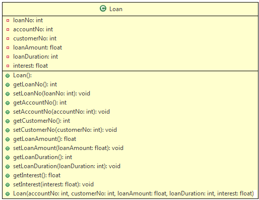

# Problem Statement:

Objective: To understand how to create variables, blocks, and methods using static and how to instantiate objects outside the class for the class's private constructors.

Problem Description: Create a Loan class for the class diagram shown

 
 

Exercise-a (Static variable and method):

## Objective: 
To understand how to create static variables and methods and their usage.

## Problem Description: 
To count the number of objects created using static variable and method

### Step 1: 
To the above Loan class add a static variable loanCounter and the corresponding static getter method.

 
 
### Step 2: 
In both, the constructors of the Loan class add the following statement

 

### Step 3: 
Use the below skeleton code for the Tester class to do the required implementation.

<pre class="prettyprint linenums:1 prettyprinted" id="codepane0" style=""><ol class="linenums"><li value="1" class="L0"><code class="language-java">public class LoanTester{</code></li><li class="L1"><code class="language-java">   public static void main (String[] args){</code></li><li class="L2"><code class="language-java"></code></li><li class="L3"><code class="language-java">      //Create 2 objects of Loan class using the default and 2 using parametrized constructor.</code></li><li class="L4"><code class="language-java">      //Use getter methods and display the value of loanCounter for every instance</code></li><li class="L5"><code class="language-java"></code></li><li class="L6"><code class="language-java">  }</code></li><li class="L7"><code class="language-java">}</code><button id="copyButton0" class="transparent-button" tabindex="0" aria-label="copy" onclick="copyToClipBoardFunction(codepane0,copyButton0)" style="float: right; color: white;"></button></li></ol></pre>

Step 4: Compile and execute the program

Summary of this exercise:

You have learned

How to create static variables and methods