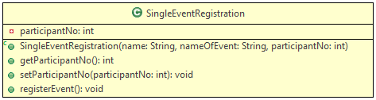
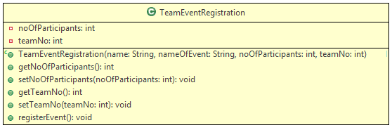

# Problem Statement:

Objective: To understand the concept of method overriding and super keyword.

Problem Description: A college cultural event "Show Your talent" is being conducted and the organizing committee has decided to come up with online registration for the same. Initially, the registration fee for single and team events was the same, but later the organizing committee decided to calculate the registration fee based on the number of participants.

The students can participate in single events as well as team events. The portal displays the team number for a team and the participant number for a participant.

Create a Java Project with the name OverridingAndSuper Implement the class EventRegistration, SingleEventRegistration, and TeamEventRegistration.

 

## Class Description:

## EventRegistration:

This is the parent class for SingleEventRegistration and TeamEventRegistration classes. It sets the name, name of the event, and registration fee.

## Methods Description:

registerEvent(): In the class EventRegistration it displays the registration fee based on the event for which the participant is going to register.

<table class="tbl-holder__tbl">
	<thead>
		<tr>
			<th>Events</th>
			<th>Base Fee</th>
		</tr>
	</thead>
	<tbody>
		<tr>
			<td>ShakeALeg</td>
			<td>100</td>
		</tr>
		<tr>
			<td>Sing&amp;Win</td>
			<td>150</td>
		</tr>
		<tr>
			<td>Actathon</td>
			<td>70</td>
		</tr>
		<tr>
			<td>PlayAway</td>
			<td>130</td>
		</tr>
	</tbody>
</table>

### SingleEventRegistration:

This class is used to register the participants for Singles Events.

## Method Description:

registerEvent(): In class SingleEventRegistration this method calculates the registration fee and displays the participant number. The single event registration is only for three events given in the table below:

<table class="tbl-holder__tbl">
	<thead>
		<tr>
			<th>Events</th>
			<th>Base Fee</th>
		</tr>
	</thead>
	<tbody>
		<tr>
			<td>ShakeALeg</td>
			<td>100</td>
		</tr>
		<tr>
			<td>Sing&amp;Win</td>
			<td>150</td>
		</tr>
		<tr>
			<td>PlayAway</td>
			<td>130</td>
		</tr>
	</tbody>
</table>

### TeamEventRegistration:

This class is used to register participants for Team Events.

## Method Description:

registerEvent(): In class TeamEventRegistration the registrationFee is calculated based on the number of participants:
registrationFee = baseFee x noOfParticipants

This method also displays the team number. The base fee for the events per participants is shown below-

<table class="tbl-holder__tbl">
	<thead>
		<tr>
			<th>Events</th>
			<th>Base Fee</th>
		</tr>
	</thead>
	<tbody>
		<tr>
			<td>ShakeALeg</td>
			<td>50</td>
		</tr>
		<tr>
			<td>Sing&amp;Win</td>
			<td>60</td>
		</tr>
		<tr>
			<td>Actathon</td>
			<td>80</td>
		</tr>
		<tr>
			<td>PlayAway</td>
			<td>100</td>
		</tr>
	</tbody>
</table>

Create a class ShowYourTalentRegistration and implement the main method as given below

<pre class="prettyprint linenums:1 prettyprinted" id="codepane0" style=""><ol class="linenums"><li value="1" class="L0"><code class="language-java">public class ShowYourTalentRegistration{</code></li><li class="L1"><code class="language-java">   public static void main(String[] args){</code></li><li class="L2"><code class="language-java">      //TO-DO :Create an instance of SingleEventRegistration with reference of EventRegistration</code></li><li class="L3"><code class="language-java">      //as participant1, and initialize the same with values given</code></li><li class="L4"><code class="language-java">      //TO-DO :Invoke the method registerEvent using participant1</code></li><li class="L5"><code class="language-java">      //TO-DO :Create an instance of TeamEventRegistration with reference of EventRegistration</code></li><li class="L6"><code class="language-java">      //as team1, and initialize the same with values given</code></li><li class="L7"><code class="language-java">      //TO-DO :Invoke the method registerEvent using team1</code></li><li class="L8"><code class="language-java">      //TO-DO :Create an instance of SingleEventRegistration with reference of EventRegistration</code></li><li class="L9"><code class="language-java">      //as participant2, and initialize the same with values given</code></li><li class="L0"><code class="language-java">      //TO-DO :Invoke the method registerEvent using participant2</code></li><li class="L1"><code class="language-java">    }</code></li><li class="L2"><code class="language-java">}</code><button id="copyButton0" class="transparent-button" tabindex="0" aria-label="copy" onclick="copyToClipBoardFunction(codepane0,copyButton0)" style="float: right; color: white;"></button></li></ol></pre>

&nbsp;

Initialize the instances of SingleEventRegistration and TeamEventRegistration with the values given:

## Inputs (For SingleEventRegistration):

<table class="tbl-holder__tbl">
	<thead>
		<tr>
			<th>Attributes</th>
			<th>Values</th>
		</tr>
	</thead>
	<tbody>
		<tr>
			<td>name</td>
			<td>Jenny</td>
		</tr>
		<tr>
			<td>nameOfEvent</td>
			<td>Sing&amp;Win</td>
		</tr>
		<tr>
			<td>participantNo</td>
			<td>1</td>
		</tr>
	</tbody>
</table>

<table class="tbl-holder__tbl">
	<thead>
		<tr>
			<th>Attributes</th>
			<th>Values</th>
		</tr>
	</thead>
	<tbody>
		<tr>
			<td>name</td>
			<td>Hudson</td>
		</tr>
		<tr>
			<td>nameOfEvent</td>
			<td>PlayAway</td>
		</tr>
		<tr>
			<td>participantNo</td>
			<td>2</td>
		</tr>
	</tbody>
</table>

## Input (For TeamEventRegistration):

<table class="tbl-holder__tbl">
	<thead>
		<tr>
			<th>Attributes</th>
			<th>Values</th>
		</tr>
	</thead>
	<tbody>
		<tr>
			<td>name</td>
			<td>Aura</td>
		</tr>
		<tr>
			<td>nameOfEvent</td>
			<td>ShakeALeg</td>
		</tr>
		<tr>
			<td>teamNo</td>
			<td>1</td>
		</tr>
		<tr>
			<td>noOfParticipants</td>
			<td>5</td>
		</tr>
	</tbody>
</table>

### The output after executing the main method is:

Thank You Jenny for your participation.Your registration fee is: 150.0
You are participant no: 1
Thank You Aura for your participation.Your registration fee is: 250.0
You are participant no: 1
Thank You Hudson for your participation.Your registration fee is: 130.0
You are participant no: 2

If a participant enters an invalid event an appropriate message should be displayed as given below:

Please choose a valid event

### Summary of this exercise:

You have learned the concept of overriding and the usage of the super keyword.